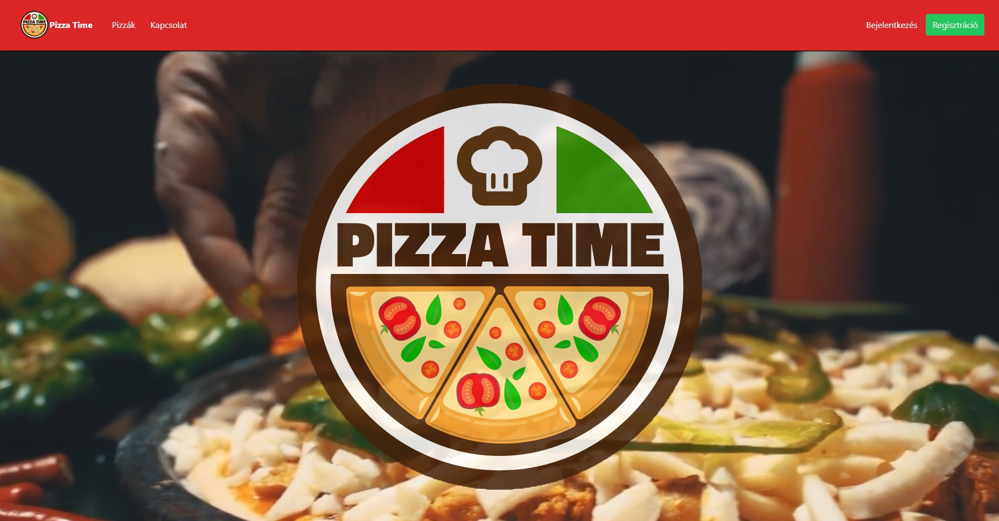
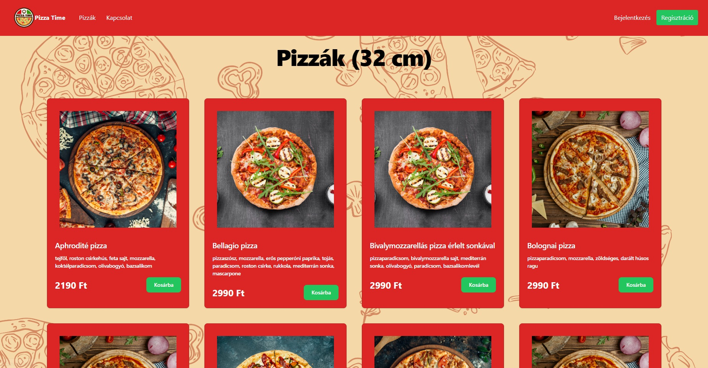
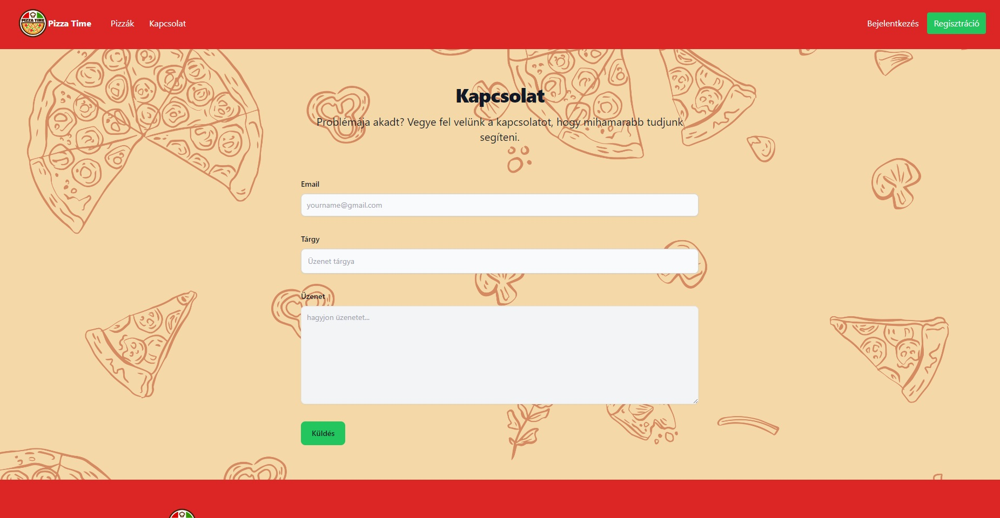
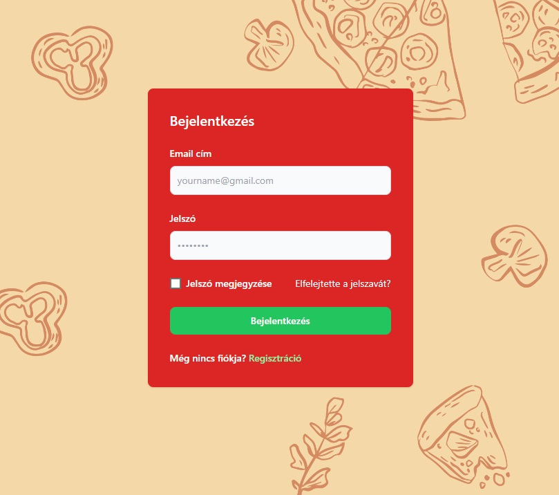
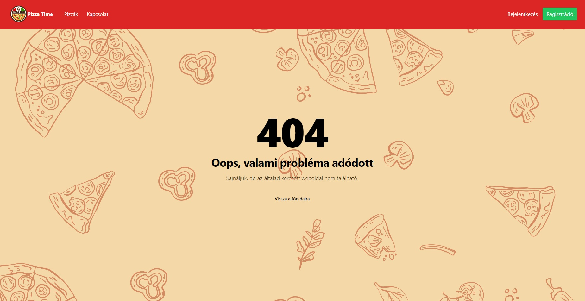

# Pizza Time Webstore
Fictive Web Store, using React and Tailwind CSS. This project was made as a university project for web development homework.
I styled the page myself and wrote the code for it. Every assets I used in the project was free. The language of the application is Hungarian.

## Features
- Home, Contact, Login, Register, Error404, Pizza browsing pages 
- Video background on the frontpage
- Pizza datas displayed from SQL database

## Used Softwares, Frameworks & Utilities
- Visual Studio Code
- React
- Tailwind CSS
- SQL

## Run Locally
Clone my repository
```bash
  git clone https://github.com/istvanszasz99/WebstoreProject.git
```

Go to the project directory
```bash
  cd WebstoreProject
```

Install dependencies
```bash
  npm install
```

Start the server
```bash
  npm start
```

## Preview
Open [http://localhost:3000](http://localhost:3000) to view it in your browser.

## Screenshots







## Author
- [@istvanszasz99](https://www.github.com/istvanszasz99)
